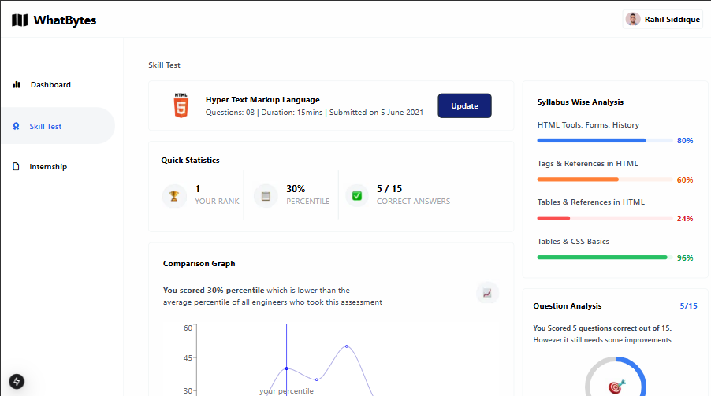

> Frontend Intern Assessment

### [Homepage]()

## Getting Started

### Prerequisites
- Node.js (version 16.8 or later)
- npm (Node Package Manager)

### Clone the Repository

```bash
# Clone the repository
git clone https://github.com/Chidera0001/whatbytes.git

# Navigate to the project directory
cd whatbytes

# Install dependencies
npm install
```

## Development

```bash
# Run the development server
npm run dev
```

Then open [http://localhost:3000](http://localhost:3000) in your browser to see the result.

## Production

```bash
# Build for production
npm run build

# Start production server
npm start
```

## Dashboard Look
<p>
  
</p>

## Technology Stack
- **Framework**: Next.js
- **Styling**: TailwindCSS
- **Charts**: React Recharts UI library
- **Progress Bar**: React-circular-progressbar UI library

## Author

**Chidera Udoneso Anele**

* Github: [@Chidera0001](https://github.com/Chidera0001)
* LinkedIn: [Chidera Anele](https://www.linkedin.com/in/chidera-anele/)